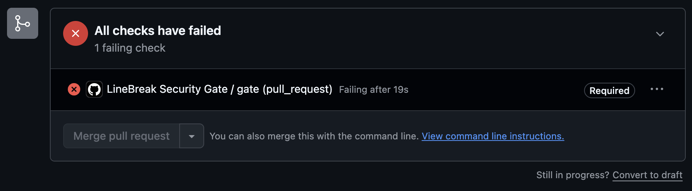

# gate-demo

**A live demo of the [LineBreak Security Gate](https://www.linebreakapp.com/en/gate): the CI check that refuses to merge AI-written code carrying known vulnerabilities.**

## What to look at

**[Pull request #1](https://github.com/Baktun-Studio/gate-demo/pull/1)** was authored by an AI agent. It pins `pyyaml` to 5.3.1, a version with a known critical vulnerability (CVE-2020-14343, arbitrary code execution). The `gate` check failed, the check is required, and the merge button stays gray:



Nothing here is mocked. The gate ran in this repository's CI, found the CVE via OSV, and refused. It fails CLOSED: if the scanner itself crashes, the check fails too. The only way past it is a human override, scoped to that one package+version+CVE, committed to git with a name on it. No bot can approve that merge.

## Try it on your repo

Free, no account:

```
uv tool install linebreak-gate
```

Guided first run (~10 min): https://www.linebreakapp.com/en/start

*This repo's own main branch is protected by the same gate. Every change you see merged here passed it.*
